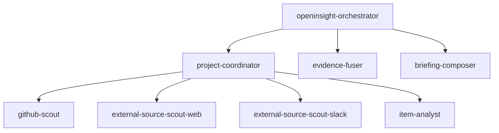

# OpenInsight Multi-Agent Runtime

这份文档描述当前仓库里的 OpenInsight 多代理 `delivery` runtime，目标是把职责边界和上下文边界写清楚，避免 prompt 设计重新耦合。

## 1. 核心原则

1. **唯一个性化入口**：只有 `openinsight-orchestrator` 能读取原始用户 prompt。
2. **项目配置解耦**：项目级事实只维护在 `projects/*.md`，并且只有 `project-coordinator` 能直接读取。
3. **逐级消化再下传**：父 agent 必须先把上下文压缩成结构化 brief，再把更小的上下文传给子 agent。
4. **流程优先于人设**：`.opencode/agents/*.md` 只保证流程通、契约稳、边界清晰；不承载 PL / 开发骨干 / 部门战略这类持久化人设。

## 2. 三条上下文通道

| 通道 | 归属方 | 作用 | 允许到达哪里 |
| --- | --- | --- | --- |
| 原始用户 prompt | `openinsight-orchestrator` | 定义本次 run 的分析视角、时间窗口、重点主题、目标项目和输出偏好 | 只到 orchestrator |
| `projects/*.md` | `project-coordinator` | 定义项目级数据源、repo 关系、版本映射和本地分析策略 | 只允许 coordinator 直接读取 |
| runtime artifacts | 上游 agent | 逐级传递缩减后的结构化上下文 | 只在父子 agent 间流动 |

结论：

- 不使用 `users/*`
- 不使用 `department_strategy.md`
- 不把原始用户 prompt 一路透传给所有 agent
- 不允许用户 prompt 临时覆盖 `projects/*.md`

## 3. 拓扑



运行关系是固定的：

- `openinsight-orchestrator`：唯一主入口
- `project-coordinator`：唯一项目级 dispatcher
- scouts / `item-analyst`：只服务于单项目协调器
- `evidence-fuser`：唯一跨项目排序层
- `briefing-composer`：唯一成稿层

## 4. 运行流程

1. `openinsight-orchestrator` 读取原始用户 prompt。
2. orchestrator 把 prompt 翻译成 `session_directives`。
3. orchestrator 决定 `target_projects[]`。
4. orchestrator 为每个目标项目生成一个 `project_run_brief`。
5. `project-coordinator` 读取对应的 `projects/<project>.md`。
6. coordinator 结合项目配置和 `project_run_brief`，生成若干 `source_discovery_brief`。
7. scouts 返回压缩后的 `candidate_card[]`。
8. coordinator 把少量高价值候选收敛成 `selected_candidate`，再扩展成 `item_analysis_brief`。
9. `item-analyst` 深读单条候选，返回 `item_brief`。
10. coordinator 汇总为 `project_evidence_pack`。
11. orchestrator 调用 `evidence-fuser` 生成 `ranked_event[]`。
12. orchestrator 调用 `briefing-composer` 生成 `mail_html + trace`。
13. orchestrator 持久化结果到 `daily_report/`。

## 5. Artifact Contract

| Artifact | 生产者 | 消费者 | 用途 |
| --- | --- | --- | --- |
| `session_directives` | orchestrator | orchestrator / downstream briefs | 本次 run 的结构化个性化配置 |
| `session_delivery_plan` | orchestrator | orchestrator | 控制面计划、预算、假设 |
| `project_run_brief` | orchestrator | `project-coordinator` | 单项目运行范围与偏好 |
| `source_discovery_brief` | `project-coordinator` | scouts | 单项目单来源的最小发现上下文 |
| `candidate_card` | scouts | `project-coordinator` | 候选线索摘要 |
| `selected_candidate` | `project-coordinator` | `project-coordinator` | 规范化后的深读目标 |
| `item_analysis_brief` | `project-coordinator` | `item-analyst` | 深读所需的最小上下文 |
| `item_brief` | `item-analyst` | `project-coordinator` | 单条候选的深读结论 |
| `project_evidence_pack` | `project-coordinator` | orchestrator / `evidence-fuser` | 单项目交付包 |
| `ranked_event` | `evidence-fuser` | orchestrator / `briefing-composer` | 跨项目排序后的事件 |
| `trace` | `briefing-composer` | orchestrator / consumers | 最终输出的来源与工具映射 |

### 5.1 `session_directives`

推荐最小字段：

- `audience_lens`
- `focus_topics[]`
- `deprioritized_topics[]`
- `time_window`
- `ranking_bias[]`
- `output_preferences`
- `target_projects[]`
- `assumptions[]`

`session_directives` 只描述本次运行的偏好，不写入仓库长期状态。

### 5.2 `project_run_brief`

推荐最小字段：

- `project_id`
- `scoped_directives`
- `source_budget`
- `deep_read_budget`
- `assumptions[]`

它的作用是把 orchestrator 的全局偏好裁剪成“这个项目现在该怎么跑”，而不是替代 `projects/*.md`。

### 5.3 `item_analysis_brief`

推荐最小字段：

- `selected_candidate`
- `focus_topics[]`
- `output_expectations`
- `analysis_mode`
- `code_context`

它让 `item-analyst` 只拿到深读必需的信息，而不是整个项目背景或用户原始 prompt。

## 6. Agent Responsibilities

### 6.1 `openinsight-orchestrator`

- 唯一读取原始用户 prompt
- 唯一决定 `target_projects[]`
- 负责把 prompt 翻译成结构化 `session_directives`
- 不直接抓取 source
- 不直接调用 scout 或 `item-analyst`

### 6.2 `project-coordinator`

- 唯一直接读取 `projects/*.md`
- 负责把项目配置与 run 级偏好合并
- 负责 source 激活、候选归一化、深读输入构造
- 不做跨项目排序

### 6.3 Scouts

- 只做发现，不做深读
- 只返回 `candidate_card[]`
- 不读原始用户 prompt
- 不读 `projects/*.md`

### 6.4 `item-analyst`

- 只深读单个 `item_analysis_brief`
- 不做 broad scout
- 不做跨项目排序
- 只在显式 `repo@ref/sha` 上做 code-aware 分析

### 6.5 `evidence-fuser`

- 只消费 `project_evidence_pack[]`
- 是唯一跨项目排序层
- 只接受 compact ranking preferences，不接受原始用户 prompt

### 6.6 `briefing-composer`

- 只消费 `ranked_event[]`、trace-ready evidence 和 output preferences
- 是唯一成稿层
- 不自行引入隐藏 persona 或部门策略

## 7. 项目配置面

`projects/*.md` 继续作为项目级配置面，推荐最小结构：

```md
# <Project> Project Config

## Data Sources
- source: ...
  type: github | website | discourse | slack
  fetcher: ...
  scope: [...]

## Repository Context
- primary_repo: <owner/repo>
- related_repos:
  - repo: <owner/repo>
    role: upstream | dependency | related

## Version Mapping
- project_ref: <tag-or-branch>
  repo_refs:
    - repo: <owner/repo>
      ref: <tag-or-branch>

## Local Cache Policy
- local_analysis_enabled: true | false
- repo_cache_dir: .cache/openinsight/repos
- worktree_dir: .cache/openinsight/worktrees
```

允许用户 prompt 做的事：

- 指定本次只跑哪些已配置项目
- 指定本次更关心哪些主题
- 指定时间窗口、输出风格、排序偏好

不允许用户 prompt 做的事：

- 临时添加新的 source
- 临时修改 repo 映射或版本映射
- 临时改变本地分析策略

## 8. 示例 prompt

```text
run one OpenInsight daily delivery
```

```text
PL lens, only cover pytorch and torch-npu, focus on breaking changes and ecosystem impact from the last 7 days
```

```text
Core maintainer lens, all configured projects, prioritize API churn, release blockers, and notable maintainer discussions this week
```

## 9. 当前非目标

当前 runtime 明确不处理：

- `users/*`、持久化画像、持久化偏好
- `department_strategy.md` 或其他全局策略文件
- reply-feedback 闭环
- SMTP / IMAP / 队列 / 数据库 / PII 映射
- 非 `delivery` 链路
