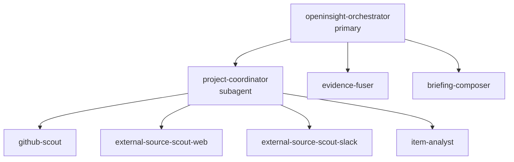

# OpenInsight Multi-Agent 设计（OpenCode 内部）

## 1. 文档定位

本文档只定义 OpenInsight 在 **OpenCode 内部** 的 multi-agent 设计，用于完成一次 `delivery` 链路中的检索、深读、融合与成稿。

本文档是一个 **OpenCode 运行时编排规范**，不是系统总架构文档；以下内容不在本文档范围内：

运行时所需的最小上下文应以内置于 `.opencode/instructions.md`、`.opencode/agents/*.md` 与 `.opencode/skills/*` 的内容为准；agent 不应依赖“显式引用本文档”才能知道 workflow、拓扑或 artifact contract。

- 用户回复与偏好更新
- 调度、投递、收信
- 身份映射、隐私边界、日志存储
- OpenCode 之外的任何组件设计

## 2. 规范来源

本文以 OpenCode 官方文档为准，并在编写过程中使用 Context7 对齐字段名、配置面与能力边界。

- Agents: <https://opencode.ai/docs/agents>
- Commands: <https://opencode.ai/docs/commands>
- Skills: <https://opencode.ai/docs/skills>
- MCP Servers: <https://opencode.ai/docs/mcp-servers>

如果本文与官方文档冲突，以官方文档为准。

## 3. 设计目标

- **上下文隔离**：检索、深读、融合、写作分层进行，避免原始 MCP 噪声污染成稿上下文。
- **项目隔离**：每个项目单独收敛证据，再进入跨项目融合。
- **结果结构化**：subagent 之间只传递 OpenInsight 内部约定对象，不传递长篇原文。
- **拓扑无环**：subagent 只把结果返回给直接调用者，不反向调用父 agent，也不与 sibling agent 直接通信。
- **能力可控**：工具、MCP、skills、task 权限按 agent 单独配置。

## 4. OpenCode 中的基本约束

### 4.1 Agent 类型

按照官方文档，OpenCode 只有两类 agent：

- `primary agent`：用户直接交互的主 agent
- `subagent`：由主 agent 或其他 agent 调用的专用 agent

OpenInsight 的默认主 agent 为 `openinsight-orchestrator`；其余角色全部定义为 `subagent`。

### 4.2 调用语义

- `openinsight-orchestrator` 负责一次 `delivery` 的入口、分发与最终聚合。
- `project-coordinator(<project>)` 表示一次项目级 subagent 调用实例，不表示必须为每个项目维护一份独立的 agent 配置。
- subagent 的输出必须回到直接调用者，再由调用者决定下一步 fan-out 或 fan-in。
- 本设计不依赖任何“全局 workflow 引擎语义”；依赖的是 OpenCode 官方支持的 primary/subagent、commands、skills、permissions 与 per-agent MCP 配置。

### 4.3 工具与 MCP 原则

- 检索类 agent 只获得完成自身任务所需的 MCP 与工具。
- `briefing-composer` 不应拥有搜索、浏览器抓取或社区检索类 MCP。
- 重型 MCP 默认全局关闭，再按 agent 局部开启。
- 文档、审阅、规范对齐类工作可以开启 `Context7`；生产态 `delivery` 链路不要求依赖 `Context7` 产出内容。

## 5. Agent 拓扑

### 5.1 核心角色

| Agent | Mode | 责任 | 允许调用 |
| --- | --- | --- | --- |
| `openinsight-orchestrator` | `primary` | 生成本轮 `session_delivery_plan`，按项目分发任务，聚合项目证据，触发融合与成稿 | `project-coordinator`、`evidence-fuser`、`briefing-composer` |
| `project-coordinator` | `subagent` | 读取单项目配置与本轮计划，调度该项目的 scout 与深读 | `github-scout`、`external-source-scout-web`、`external-source-scout-slack`、`item-analyst` |
| `github-scout` | `subagent` | 只处理 GitHub 来源的候选发现与压缩 | 无 |
| `external-source-scout-web` | `subagent` | 只处理官网、博客、论坛等 Web 来源的候选发现与压缩 | 无 |
| `external-source-scout-slack` | `subagent` | 只处理 Slack 来源的候选发现与压缩 | 无 |
| `item-analyst` | `subagent` | 深读单个候选，输出结构化 `item_brief` | 无 |
| `evidence-fuser` | `subagent` | 融合多个项目的证据包，输出跨项目排序结果 | 无 |
| `briefing-composer` | `subagent` | 从 `ranked_event[]` 与 `trace` 线索生成最终 `mail_html` | 无 |

### 5.2 调用图



这张图只表示“谁可以调用谁”。结果回传方向始终是：**子 agent 返回给直接调用者**。

## 6. `delivery` 运行流程

1. `openinsight-orchestrator` 接收一次 `delivery` 请求，生成本轮 `session_delivery_plan`。
2. `openinsight-orchestrator` 按项目 fan-out 多次调用 `project-coordinator`。
3. 每个 `project-coordinator` 读取对应 `projects/*.md` 配置，决定本项目要启用的 source、候选上限与深读配额。
4. `project-coordinator` 并行调用 `github-scout`、`external-source-scout-web`、`external-source-scout-slack`，收集并压缩候选为 `candidate_card[]`。
5. `project-coordinator` 只挑选少量高价值候选，并将其归一化为 `selected_candidate[]`。
6. `project-coordinator` 将 `selected_candidate[]` 交给 `item-analyst` 深读，得到 `item_brief[]`。
7. 每个 `project-coordinator` 返回一个 `project_evidence_pack` 给 `openinsight-orchestrator`。
8. `openinsight-orchestrator` 调用 `evidence-fuser`，把多项目证据包融合为 `ranked_event[]`。
9. `openinsight-orchestrator` 调用 `briefing-composer`，输出 `mail_html` 与最终 `trace`。

## 7. 各 agent 的职责边界

### 7.1 `openinsight-orchestrator`

- 唯一主入口。
- 只持有高层计划、项目级摘要和最终聚合结果。
- 不直接读取原始 GitHub/论坛/Slack 长文本。
- 不直接写最终社区结论；融合和成稿分别交给专用 subagent。

### 7.2 `project-coordinator`

- 作用域始终限制在单个项目内。
- 负责本项目的 source 调度、候选筛选、候选归一化和深读配额控制。
- 不直接写最终邮件。
- 可以读取项目配置，但不负责跨项目排序。
- 对来自 GitHub、Web、Slack 的候选执行统一归一化，解析 `canonical_subject`。
- 决定 `analysis_mode`：`narrative-only`、`code-aware-remote` 或 `code-aware-local`。
- 对需要代码校验的候选补齐显式 `repo@ref/sha`，再交给 `item-analyst`。

### 7.3 `github-scout`

- 只处理 GitHub 来源。
- 输出候选卡片，不输出最终结论。
- 返回内容必须是短结构，不携带大段 PR/Issue/评论原文。

### 7.4 `external-source-scout-web`

- 只处理 Web 来源，例如官网、博客、论坛。
- 默认优先轻量抓取；只有在证据不足时才升级到更重的浏览能力。
- 输出仍然是 `candidate_card[]`，不是成稿。

### 7.5 `external-source-scout-slack`

- 只处理 Slack 来源。
- 只读取项目允许的工作区/频道范围。
- 输出候选卡片，不做全局总结。

### 7.6 `item-analyst`

- 一次只深读一个标准化候选。
- 输出 `item_brief`，至少回答：发生了什么、为什么重要、影响范围、建议动作、证据引用。
- 不负责排序多个项目，也不直接输出邮件段落。
- 对 `code-aware-*` 候选，必须基于 `project-coordinator` 提供的显式 `repo@ref/sha` 做分析。
- 如果代码上下文缺失或矛盾，必须返回 coverage gap，而不是猜测性结论。

### 7.7 `evidence-fuser`

- 只消费 `project_evidence_pack[]`。
- 不重新发起检索。
- 负责跨项目统一排序、去重、归并和覆盖说明。

### 7.8 `briefing-composer`

- 只消费 `ranked_event[]` 与 `trace` 线索。
- 不直接接触原始 MCP 输出。
- 负责生成最终 `mail_html`，并确保 `trace` 能反推来源。

## 8. OpenInsight 内部约定对象

以下对象是 **OpenInsight 内部约定 artifact**，不是 OpenCode 官方内建类型。

| 对象 | 作用 | 最小要求 |
| --- | --- | --- |
| `session_delivery_plan` | 本轮 delivery 的控制面对象 | 至少包含项目列表、优先级、source 预算、深读配额 |
| `candidate_card` | scout 压缩后的候选线索 | 至少包含来源、链接、摘要、入选原因，以及轻量级 canonical subject hint / linked URLs |
| `selected_candidate` | 交给 `item-analyst` 的标准化单条候选 | 至少包含 `canonical_subject`、`analysis_mode`、`code_context` |
| `item_brief` | 单条候选的深读结果 | 至少包含影响、建议动作、证据引用，以及 analysis basis |
| `project_evidence_pack` | 单项目交付给 orchestrator 的证据包 | 至少包含 `item_brief[]` 与覆盖状态 |
| `ranked_event` | 跨项目融合后的排序结果 | 至少包含优先级、影响摘要、引用集合 |
| `trace` | 最终交付使用的来源与工具摘要 | 必须能反推本轮使用了哪些来源与链接 |

设计约束：父 agent 只保留这些结构化对象，不把正文全文、评论全文、diff 全文重新塞回自己的上下文。

### 8.1 `selected_candidate`

`selected_candidate` 是 `project-coordinator` 交给 `item-analyst` 的唯一深读输入，用来把“多来源候选”收敛成“可复现的分析上下文”。

最小建议字段：

- `source_type`: `github | web | slack`
- `kind`: `pr | issue | release | discussion | blog | forum_post | slack_thread`
- `canonical_subject`
  - `repo`
  - `kind`
  - `number` / `tag` / `commit_sha`
  - `url`
- `linked_subjects[]`
- `analysis_mode`: `narrative-only | code-aware-remote | code-aware-local`
- `code_context.repositories[]`
  - `repo`
  - `role`: `primary | upstream | dependency | related`
  - `ref`
  - `sha`
  - `compare_base_sha` / `compare_head_sha`
  - `local_checkout_path`
- `changed_files[]`
- `resolution_notes[]`

约束：

- `narrative-only`：允许只基于叙事证据分析，但必须明确没有做代码上下文校验。
- `code-aware-remote`：默认开源模式；依赖 GitHub MCP 按显式 `repo@ref/sha` 读取。
- `code-aware-local`：可选增强模式；依赖本地 repo cache / worktree。
- 任何 `code-aware-*` 候选若缺少确定 `repo@ref/sha`，必须返回 coverage gap。

### 8.2 项目级配置面

`projects/*.md` 是运行时配置面，由 `project-coordinator` 读取，用于决定：

- 要启用哪些 source
- 仓库关系（主仓、上游、依赖、相关仓）
- 版本映射规则
- 是否启用本地 repo cache / worktree 增强模式

推荐最小结构：

```md
# <Project> Project Config

## Data Sources
- source: ...
  type: github | website | discourse | slack
  fetcher: ...
  scope: [...]

## Repository Context
- primary_repo: <owner/repo>
- related_repos:
  - repo: <owner/repo>
    role: upstream | dependency | related

## Version Mapping
- project_ref: <tag-or-branch>
  repo_refs:
    - repo: <owner/repo>
      ref: <tag-or-branch>

## Local Cache Policy
- local_analysis_enabled: true | false
- repo_cache_dir: .cache/openinsight/repos
- worktree_dir: .cache/openinsight/worktrees
```

## 9. 推荐配置方式

### 9.1 Agent 配置载体

官方支持两种主要配置面：

- `opencode.json`
- `.opencode/agents/*.md`

推荐做法：

- 在 `opencode.json` 中定义默认 agent、task 权限和全局工具开关。
- 在 `.opencode/agents/*.md` 中维护职责清晰、可单独审阅的 subagent prompt。

### 9.2 推荐的 `opencode.json` 结构

下面的示例只展示 **OpenInsight 需要的关键字段名**，字段命名与能力边界对齐官方文档。

```json
{
  "$schema": "https://opencode.ai/config.json",
  "agent": {
    "openinsight-orchestrator": {
      "mode": "primary",
      "description": "Entry point for one delivery run",
      "permission": {
        "task": {
          "*": "deny",
          "project-coordinator": "allow",
          "evidence-fuser": "allow",
          "briefing-composer": "allow"
        }
      }
    },
    "project-coordinator": {
      "mode": "subagent",
      "description": "Coordinates one project's scouts and deep reads",
      "permission": {
        "task": {
          "*": "deny",
          "github-scout": "allow",
          "external-source-scout-web": "allow",
          "external-source-scout-slack": "allow",
          "item-analyst": "allow"
        }
      }
    },
    "github-scout": {
      "mode": "subagent"
    },
    "external-source-scout-web": {
      "mode": "subagent"
    },
    "external-source-scout-slack": {
      "mode": "subagent"
    },
    "item-analyst": {
      "mode": "subagent"
    },
    "evidence-fuser": {
      "mode": "subagent"
    },
    "briefing-composer": {
      "mode": "subagent"
    }
  }
}
```

### 9.3 Markdown agent 示例

对于职责明确的 subagent，推荐使用 `.opencode/agents/*.md` 维护 prompt。

```md
---
description: Writes the final briefing from ranked events and trace-ready evidence
mode: subagent
tools:
  bash: false
  edit: false
  write: false
---

You are the briefing composer for OpenInsight.

Rules:
- Only use structured ranked events and trace-ready evidence
- Do not fetch new evidence
- Do not read raw MCP output
- Produce final mail_html and trace
```

### 9.4 Commands 绑定

官方支持在 `opencode.json` 中把命令绑定到指定 agent。

推荐至少提供一个入口命令，把一次日报/周报生成明确绑定到 `openinsight-orchestrator`：

```json
{
  "command": {
    "daily-briefing": {
      "agent": "openinsight-orchestrator"
    }
  }
}
```

如果某个命令绑定到 `subagent`，官方默认会以 subagent 调用方式执行，除非显式设置 `subtask: false`。

### 9.5 Skills 使用原则

- 用 `.opencode/skills/*/SKILL.md` 封装重复出现的工作流约束，例如项目检索规则、成稿风格、审阅清单。
- skills 用于补充执行约束，不替代 agent 拓扑设计。
- skill 权限应保持最小化；agent 的调用边界仍以 `permission.task` 和工具权限为准。

### 9.6 MCP 与工具开关

官方支持把 MCP 全局关闭、再按 agent 局部开启。

OpenInsight 的推荐策略是：

- `github-scout` 只开启 GitHub 检索相关 MCP
- `external-source-scout-web` 只开启网页抓取/浏览能力
- `external-source-scout-slack` 只开启 Slack 相关 MCP
- `item-analyst` 默认走 `code-aware-remote`，只围绕已提供的 `repo@ref/sha` 读取所需证据
- `item-analyst` 不直接持有 broad scout 能力，不自行决定版本映射或 checkout 策略
- `briefing-composer` 不开启任何社区检索 MCP

默认部署建议是 **remote-first**：

- 默认只依赖 GitHub MCP 精确读取 `repo@ref/sha`
- 本地 repo cache / worktree 是可选增强模式，不是开源部署前置条件

推荐本地目录：

```text
.cache/openinsight/repos/github.com/pytorch/pytorch.git
.cache/openinsight/worktrees/pytorch-pytorch/v2.7.1-<sha>
.cache/openinsight/worktrees/ascend-torch-npu/v2.7.1-<sha>
```

## 10. 约束与非目标

### 10.1 这份文档明确要求的约束

- 不设计 `delivery` 之外的链路。
- 不把 sibling agent 之间的消息传递建模为运行时能力。
- 不把 OpenInsight 内部 artifact 误写成 OpenCode 官方 schema。
- 不把具体模型名写死到拓扑里；模型选择属于运行时配置，不属于本文的稳定接口。

### 10.2 这份文档明确不做的事情

- 不定义用户回复解析与画像更新链路。
- 不定义 OpenCode 外部的服务、队列、数据库、邮件链路。
- 不定义任何与检索无关的 UI 组件。

## 11. 结论

OpenInsight 在 OpenCode 内部采用一个主 agent + 多个职责清晰的 subagent：

- `openinsight-orchestrator`：唯一入口与最终聚合
- `project-coordinator`：单项目调度与候选归一化
- `github-scout` / `external-source-scout-web` / `external-source-scout-slack`：按来源检索
- `item-analyst`：基于 `selected_candidate` 的单条证据深读
- `evidence-fuser`：跨项目融合
- `briefing-composer`：最终成稿与 `trace`

这套设计与 OpenCode 官方支持的 agents、commands、skills、permissions、per-agent MCP 模式保持一致，同时把 OpenInsight 的运行时对象限制为少量结构化 artifact，并把“代码版本上下文绑定”前移到 `project-coordinator`，避免 `item-analyst` 在多来源、多仓库、多版本场景下引用错误代码上下文。
