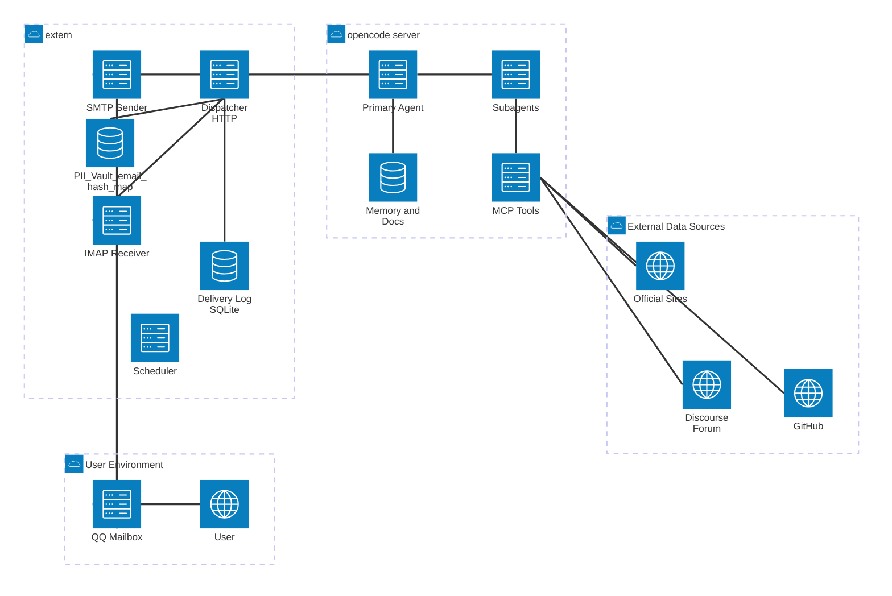

# Product Requirements Document

## 1. 产品定位

### 1.1 它是什么

OpenInsight 是一款**专为计算硬件公司开源项目组打造的、AI Native 的开源社区情报分析与战略建议系统**。它以极简的“智能邮件推播”为产品形态，以开源代码与社区分析为内核，帮助团队在繁杂的开源世界中保持敏锐的技术前瞻与商业嗅觉。

它具备以下核心属性：

1. **基于 OpenCode 构建的“重脑力”分析引擎**
   - 本产品不是对 OpenAI API 的简单包装，而是以 **OpenCode** 代理系统为底座。
   - 深度利用 OpenCode 的 **MCP（模型上下文协议）**、Skill 插件体系、以及**本地 Git 仓库同步/解析**能力，结合真实的代码演进趋势与社区讨论（Issue/PR ），进行综合研判。
   - **项目级数据源独立配置**：每个开源项目的数据源支持自己配置，为 OpenCode 维护 `projects/<project_name>.md`（例如 `projects/pytorch.md`）。
2. **极简、无感的异步投递终端（Email-UI）**
   - 不做复杂 Dashboard；产品对用户的“界面”就是一封高浓度、个性化邮件。
   - 支持角色化定制（PL vs 骨干开发）：通过维护 `users/<email_hash>.md` 用户画像（包含角色与偏好），对不同角色输出不同视角的情报摘要与建议。
3. **具备“商业嗅觉”的智能体**
   - 系统维护 `department_strategy.md`（部门战略文档），使 AI 的筛选与建议具备方向感（例如：评估某项开源变动是否有助于**华为昇腾**在该生态落地）。
4. **低阻力、自演进的反馈闭环（Single-reply Feedback）**
   - 用户只需“回复一次邮件”即可表达偏好变化（如“不再关注 A，多关注 B”），系统解析意图并更新对应 `users/<email_hash>.md`。
   - 被降权主题在发生破坏性重大事件时，仍可突破阈值在邮件中“补充预警”。
5. **白盒化可解释性**
   - 每封邮件底部提供折叠栏 `trace`：仅列出本次生成使用的工具/数据源/引用链接（不包含长篇原始片段）。

### 1.2 它不是什么

不做：代写代码 Copilot、自动替用户在社区发 PR/回 Issue、对话式 Chatbot、传统 RSS 订阅器、复杂 SaaS 后台。

## 2. 目标用户与使用场景

### 2.1 目标用户画像

供公司部门内使用，目标用户 ≤ 100 人。

1. **团队 PL（Project Lead / 架构师）**
   - 诉求：宏观战略把控、技术投资决策、团队影响力建设。特别关注**能对华为昇腾上游生态有影响的社区动态**。
   - 偏好文件：`users/<email_hash>.md`（role=PL；宏观趋势、竞品动向、新项目孵化、跨组织合作机会、昇腾生态相关影响）。
2. **骨干开发者（Core Developer）**
   - 诉求：微观技术跟踪、API 演进预警、社区影响力与核心人物动向。
   - 偏好文件：`users/<email_hash>.md`（role=Dev；模块级变更、提交者关联动态、高优 Issue/PR 讨论）。

### 2.2 核心使用场景

#### 场景 A：骨干开发的“技术防御雷达”与“动态偏好演进”

1. 每天上午固定时间收到“昨日社区高浓度日报”邮件：指出值得关注的 API/行为变动、重要 Issue/PR 链接、关键人物动态。
2. 用户直接回复邮件表达偏好迁移（例如“模块 A 暂时不关注，多推模块 B”），系统自动更新 `users/<email_hash>.md`。
3. 模块 A 隐去；若未来模块 A 发生破坏性重大变更，系统在“补充预警”提及一次，避免漏网。

#### 场景 B：团队 PL 的“一周战略沙盘”与“生态影响分析”

1. 每周收到“周度战略简报”：汇总宏观趋势、核心项目演进方向、竞品与组织动态。重点提炼**社区变动对华为昇腾生态的潜在影响与战略机会**。
2. 自动发现对业务潜在影响大的新生开源项目，并输出结构化洞察（目标/竞品/上下游/组织人物/可行动建议）。
3. 邮件底部可展开 `trace`，看到：抓取了哪些数据源、调用了哪些工具、引用了哪些链接，增强信任。

## 3. 技术架构

### 3.1 整体架构

整体拆分为两部分：`extern` + `opencode server`。

- `extern`：负责**触发（调度）**、**投递（SMTP）**、**收信（IMAP）**、把“用户回复”转换为结构化反馈，并承担**隐私边界（PII Vault）**。
- `opencode server`：负责**根据 `projects/*.md` 配置通过 MCP 获取数据（不落地 raw cache）**、**阅读研判**、**生成 mail html + trace**、以及**更新用户画像**（仅以 `email_hash` 作为用户标识，不接触明文邮箱）。



### 3.2 模块职责与边界

#### extern（管道层 + 隐私边界）

- **Scheduler**：按 `daily`、`weekly` 触发。
  - 默认时间（以服务器本地时区为准）：`daily` 每天 `09:00`；`weekly` 每周一 `09:00`。
- **PII Vault（隐私保护机制，新增）**：维护 `email -> email_hash` 映射表，提供以下能力：
  1) **新增**：给定 `email`，返回稳定的 `email_hash`（若已存在则复用）
  2) **检查**：给定 `email` 或 `email_hash` 判断是否存在映射
  3) **查询**：`email -> email_hash`、`email_hash -> email`
  4) **删除**：删除映射，并触发与该用户相关的投递日志与反馈闭环的“后续行为约束”（见 §6.2）
  - **隐私约束**：`opencode server` 不得直接或间接访问明文邮箱；extern 的日志与 HTTP 日志默认禁止打印邮箱。
- **Mail Sender（SMTP）**：把 `opencode` 返回的 `mail_html` 作为邮件正文发送给目标用户（此处使用明文邮箱，仅在 extern 内部）。
- **Mail Receiver（IMAP）**：定时拉取收件箱中新回复邮件（默认每 `15min` 轮询一次），提取相关元信息并定位 `email_hash` 与 `sessionID`：
  - IMAP 收到的 From/Reply-To 为明文邮箱：必须先走 PII Vault 得到 `email_hash` 再进入后续流程。
  - **一次回复归因**：
    - 优先解析 Reply 的 `In-Reply-To` / `References`，匹配投递日志里的 `outbound_message_id`，从而定位对应 delivery/session。
    - 若 Reply 的引用链为空，则根据发件人邮箱（经 PII Vault 得到 `email_hash`）回溯查找该用户最近一次“合法投递”（例如状态为 `sent|waiting_reply` 且尚未有 `reply_message_id`），并将该 Reply 归因到该投递。
  - **约束**：对每封投递邮件，最多处理 **1 次**用户回复（只认第一封有效回复；后续回复忽略/不进入反馈闭环）。
- **Dispatcher**：通过 HTTP 与 `opencode server` 交互，创建/定位会话、提交用户反馈、查询会话状态与结果。
  - 对 `opencode server` 的所有请求中，用户标识一律使用 `email_hash`（或等价字段 `user_id`），不出现 `email` 字段。

#### opencode server（Agent 层）

- **Primary Agent**：接收 Session 内的用户消息（生成请求与 feedback，均通过 Server API 的 messages 入口）并编排子任务：
  - 触发 subagent 依据 `projects/*.md` 项目配置，通过 MCP 去收集/检索（不落地 raw cache）。
  - 根据 `users/<email_hash>.md` + `department_strategy.md`（含华为昇腾生态战略）过滤与排序。
  - 生成 `mail_html`（含折叠 trace）。
  - 从用户反馈中解析偏好变更并更新 `users/<email_hash>.md`（文件内容不得写入明文邮箱）。
- **Subagents**：按数据源/任务类型拆分（例如 GitHub 子代理、PR 深读子代理、外部论坛抓取子代理等）。
- **Skills & MCP**：
  - Skills：可复用的分析与抽取逻辑（例如“从 PR diff 提取 Breaking Changes”、“分析讨论对昇腾生态的影响”）。
  - MCP：对外部系统/本地工具的统一上下文访问（如 GitHub MCP、Discourse MCP、Web Scraper 等）。

### 3.3 extern 与 opencode server 的通信（异步，基于 Session）

extern 与 opencode server 的对接**唯一路径**为 OpenCode Server API；字段与类型以 SDK 生成类型为准，不引入额外私有对接方式。

**权威参考（实现时必须对齐）：**
- Server API（中文）：`https://opencode.ai/docs/zh-cn/server/`
- SDK 生成类型定义（字段名/枚举值/Part 类型权威来源）：`https://github.com/anomalyco/opencode/blob/dev/packages/sdk/js/src/gen/types.gen.ts`

#### 一个用户 × 一个投递 × 一个 Session（短生命周期、强隔离）

- **每次 `daily/weekly` 投递**为该用户创建一个新的 `sessionID`，该 Session 的上下文仅用于本次投递生成。
- extern 仅负责：
  1) 创建/记录 `sessionID`
  2) 将“生成任务”以异步方式投递给该 Session
  3) 轮询 Session 状态/结果，拿到 `mail_html + trace`
  4) 将用户标识以 `email_hash` 传递给 `opencode server`，以定位 `users/<email_hash>.md`

## 4. extern 调用 OpenCode API 清单

本章节给出 extern 对 `opencode server` 的**调用能力清单**，并按“必须/可选”拆分。具体 URL path、请求/响应字段以 OpenCode Server 的 OpenAPI 为准（实现时必须对齐 §3.3 的权威参考），但 extern 需要的最小闭环能力在本章节固定下来。

### 4.1 调用约束（隐私与可观测）

- extern -> opencode 的请求体、日志与指标不得包含明文 `email`，用户标识一律使用 `email_hash`（或字段 `user_id`）
- 每次请求应携带 `delivery_id`（或等价 idempotency key）与 `sessionID` 便于链路排障
- API 调用必须可重试：GET 幂等；POST 需提供幂等键（避免重复创建 Session/重复投递任务）
- 默认采用轮询（Polling）拿结果；支持升级为 SSE 事件流（见 §4.3）

### 4.2 必须 API（MVP 闭环）

1. **健康检查**
   - `GET /health`（或等价）：用于启动时连通性检查与告警探活
2. **创建 Session（一次投递一次会话）**
   - `POST /sessions`
   - 入参（建议最小集）：`{ user_id: email_hash, kind: "daily"|"weekly", delivery_id, title? }`
   - 出参（关键）：`{ id: sessionID }`
3. **触发分析生成（把任务投递给该 Session）**
   - 主路径：`POST /sessions/{sessionID}/messages`（role=user）
   - 入参（建议最小集）：`{ user_id: email_hash, kind, time_window, projects?, instructions? }`
   - 约束：同一 `delivery_id` 的重复投递需幂等（不可生成两封邮件）
4. **查询 Session 状态（轮询）**
   - `GET /sessions/{sessionID}`：用于判断是否已产出可用结果（或用于获取更新时间戳）
5. **拉取生成结果（mail_html + trace）**
   - `GET /sessions/{sessionID}/messages`（或等价接口）
   - 约束：`opencode server` 必须以**可机读**的方式返回最终投递载荷，推荐为一个结构化 payload（例如 JSON）：
     - `mail_html`：可直接作为 SMTP 正文的 HTML
     - `trace`：工具/数据源/引用链接清单（不含邮箱）
6. **提交用户反馈（Single-reply Feedback）**
   - 主路径：`POST /sessions/{sessionID}/messages`（role=user）
   - 入参（建议最小集）：`{ user_id: email_hash, feedback_text, delivery_id, reply_message_id? }`

### 4.3 可选 API（增强能力）

1. **SSE 事件流（替代轮询）**
   - `GET /sessions/{sessionID}/events`（或等价）：用于实时获取 message parts 更新、降低轮询开销
2. **取消/中止生成**
   - `POST /sessions/{sessionID}/cancel`（或等价）：用于超时兜底与人工介入
3. **会话归档/删除**
   - `POST /sessions/{sessionID}/archive` / `DELETE /sessions/{sessionID}`（或等价）：用于清理与留存策略
4. **会话分享（仅内网可选）**
   - `POST /sessions/{sessionID}/share`（或等价）：用于生成只读分享链接（需确保不泄露 PII）
5. **会话/消息检索**
   - `GET /sessions?user_id=...`、`GET /messages/{messageID}`（或等价）：用于排障、重放、审计
6. **成本/用量查询**
   - `GET /sessions/{sessionID}/usage`（或等价）：用于观测 tokens/cost 并做限流与预算

## 5. 功能规格（v2）

### 5.1 定时投递

- **Daily（骨干开发）**：按日生成并投递邮件，覆盖“昨日”时间窗口。
- **Weekly（PL）**：按周生成并投递邮件，覆盖“上周”时间窗口，额外侧重对昇腾等关键生态的影响分析。

邮件最小结构（建议）：

1. TL;DR（3–5 条最高优先级事实/风险/机会）
2. Breaking / Risk Watch（兼容性风险、重大变更预警）
3. Ecosystem Impact（生态影响，特别是针对华为昇腾战略相关变动）
4. People & Politics（核心人物与组织动态，偏好可配置）
5. Links（引用链接列表）
6. Trace（折叠：工具/数据源/引用链接清单）

### 5.2 数据源配置 (`projects/*.md`)

通过给 OpenCode 维护 `projects/<project_name>.md` 来实现项目级别的数据源独立配置。

`projects/pytorch.md` 示例：

```md
# PyTorch Project Config

## Data Sources
- source: https://github.com/pytorch/pytorch
  type: github
  fetcher: github-mcp
  scope: [rfc, issue, pr]

- source: https://dev-discuss.pytorch.org/
  type: discourse
  fetcher: discourse-mcp (or web-scraper/rss)
  scope: [core-discussions]

- source: https://pytorch.org/
  type: website
  fetcher: web-scraper (or rss)
  scope: [blog, releases]
```

### 5.3 Single-reply Feedback（仅回复一次）

- 用户回复邮件自由文本。
- 系统解析意图并对应更新 `users/<email_hash>.md`。
- 允许在偏好中重点指出与具体业务（如昇腾）相关的关注点。
- **约束**：对每封投递邮件，extern 只处理 **1 次**回复（第一封有效）。

### 5.4 动态注意力阈值（补充预警）

- 降权主题若发生破坏性重大事件，仍可突破阈值在邮件中“补充预警”。

### 5.5 白盒可解释性（trace）

- 列出使用的工具/技能、数据源、引用链接，保障信息来源可追溯。

## 6. 数据与存储

### 6.1 已确认的存储

1. **用户画像（长期）**：`users/<email_hash>.md`。
2. **项目数据源配置（长期）**：`projects/*.md`。
3. **部门战略（长期）**：`department_strategy.md`（包含昇腾生态等宏观视角）。
4. **投递日志（长期/最小）**：extern 使用 SQLite 记录投递与回复的关键映射（不含明文邮箱）。
5. **PII Vault（长期/最小，新增）**：extern 使用 SQLite（或同一 DB）维护 `email -> email_hash` 映射表（包含明文邮箱，属于敏感数据）。

### 6.2 PII Vault：email -> email_hash 映射表（新增）

目标：把 PII（明文邮箱）限制在 extern 内部；让 `opencode server`、仓库文件路径、对外日志与 `trace` **不携带邮箱**。

#### email_hash 规范（建议）

- `email_hash` 必须满足：
  - **稳定**：同一邮箱多次“检查/新增”返回同一 `email_hash`
  - **不可逆**：不能从 `email_hash` 还原邮箱
  - **低碰撞风险**：在 ≤100 用户规模下可忽略
  - **可用作文件名**：`[a-z0-9_\\-]+`，避免特殊字符
- 推荐实现（决策：随机 ID）：
  - **随机 ID**：首次新增时生成 `email_hash = "u_" + uuidv7()`（无 uuidv7 则使用 uuidv4），写入映射表；后续复用
  - 说明：保留映射表以支持“删除/禁用/审计/迁移”与对外的统一接口。

#### 映射表字段（最小集）

单表 `user_identities`：
- `id`：主键（自增或 UUID）
- `email`：明文邮箱（敏感）
- `email_hash`：用户匿名标识（唯一）
- `status`：`active|deleted`（支持软删）
- `created_at` / `updated_at` / `deleted_at`

约束与索引：
- `email` 唯一（忽略大小写，写入前统一 `lower(email)`）
- `email_hash` 唯一

对外操作契约（extern 内部能力）：
- `add(email) -> email_hash`
- `check_by_email(email) -> bool`
- `check_by_hash(email_hash) -> bool`
- `get_hash(email) -> email_hash?`
- `get_email(email_hash) -> email?`
- `delete(email | email_hash) -> void`

#### 删除语义（与闭环一致）

当 `delete(email_hash)` 发生：
- PII Vault 将该用户置为 `deleted`
- 投递与反馈闭环停止（Scheduler 不再为其创建新的 delivery）
- 既有投递日志可保留但需脱敏（见 §6.3），并禁止再处理该用户的 IMAP 回复

### 6.3 SQLite 投递日志：从“含邮箱”到“仅含 email_hash”

单表覆盖最小闭环：一次投递（daily/weekly）与**最多一次**用户回复的关联。

建议字段（最小集）：
- `id`：本系统投递实例 ID（UUID 或自增，等价于内部 `delivery_id`）
- `user_id`：`email_hash`（不存明文邮箱）
- `kind`：`daily|weekly`
- `session_id`：对应 OpenCode 的 `sessionID`
- `outbound_message_id`：发出去的 Email Message-ID
- `reply_message_id`：用户**第一封有效回复**的 Email Message-ID（可空）
- `in_reply_to_message_id`：用户回复邮件里的 In-Reply-To（可空；用于关联到 `outbound_message_id`）
- `thread_key`：用于更稳健地做线程归一（可用 `References` 哈希/归一化值，或我们生成的 token）
- `status`：`created|sent|waiting_reply|replied|failed|archived`
- `error`：错误摘要（可空；不得包含邮箱）
- `created_at` / `sent_at` / `last_seen_reply_at`
- （可选）`duplicate_reply_count` / `last_duplicate_reply_at`：用于记录“后续重复回复”（不进入反馈闭环）

处理规则（与“最多一次回复”约束对齐）：
- 当 `reply_message_id` 为空：收到第一封符合关联条件的回复，写入 `reply_message_id`，推进状态并触发 feedback 流程。
- 当 `reply_message_id` 已存在：后续回复视为重复回复，**不触发** feedback；可仅更新 `last_seen_reply_at`，并写入/累加 `duplicate_reply_count`（如启用）。

补充：**Reply -> delivery 归因顺序（用于“仅回复一次”闭环）**

1. **引用链匹配（优先）**：解析 Reply 的 `In-Reply-To` / `References`；若命中任意投递日志 `outbound_message_id`，则将该 Reply 归因到命中的 delivery（写入 `in_reply_to_message_id` / `thread_key`）。
2. **邮箱回溯（兜底）**：若引用链为空，则取 Reply 的发件人邮箱 `email`，经 PII Vault 得到 `email_hash`；在投递日志中查找该用户最近一次“合法投递”（推荐：`status in ("sent","waiting_reply")` 且 `reply_message_id IS NULL` 且 `sent_at` 在可配置窗口内，如 7 天），并将该 Reply 归因到该投递；若查不到则忽略该 Reply（但可记脱敏的“无法归因”事件）。
3. **重复回复**：若归因到的 delivery 已存在 `reply_message_id`，则该 Reply 视为重复回复，不触发 feedback。

> 说明：SMTP 投递仍需要明文邮箱，但应仅存在于 extern 内存与 PII Vault；投递日志表不落明文邮箱。

### 6.4 从 `users/<email>.md` 迁移到 `users/<email_hash>.md`（一次性）

迁移目标：在 `opencode server` 与仓库工作区中消除“以邮箱作为文件名/主键”的依赖，仅保留 `email_hash`。

建议迁移步骤（最小可行）：
1. 以管理员身份导入现有用户邮箱列表到 PII Vault：对每个 `email` 执行 `add(email)` 得到 `email_hash`
2. 将用户画像文件从 `users/<email>.md` 重命名为 `users/<email_hash>.md`（文件内容如包含邮箱字段需移除/替换为 `email_hash`）
3. 更新所有调用链：extern 调用 `opencode server` 时只传 `email_hash`；`opencode server` 只按 `users/<email_hash>.md` 读写
4. 迁移完成后，外部接口与日志中禁止出现邮箱（用 `email_hash` 排障）

> 注：历史 Git 提交中可能仍包含邮箱文件名，是否进行历史清理（rewrite history）取决于组织合规要求，本轮不作为强制交付项。

## 7. 非功能需求

- **可用性**：支持指数退避失败重试。
- **扩展性**：通过 `projects/*.md` 可快速接入新开源项目及对应数据源获取方式。
- **限流与配额**：按需抓取时需应对多源数据并发和 rate limit 限制。
- **安全（隐私重点）**：
  - **数据最小化**：除 extern/PII Vault 外，系统其它部分（opencode server、仓库文件路径、trace、日志、监控指标）不得出现明文邮箱。
  - **边界清晰**：`extern` 负责“可识别身份”（email）到“匿名身份”（email_hash）的转换与守护；`opencode server` 只处理匿名身份。
  - **日志脱敏**：HTTP access log、应用日志、错误栈默认禁止打印邮箱；如需排障，使用 `email_hash` 作为检索键。
  - **访问控制**：PII Vault 的读写接口仅对内网/内部进程开放；删除操作需要更高权限（例如管理员 token 或运维执行）。
  - **备份与留存**：PII Vault 备份需单独加密与权限隔离；删除后遵循留存策略进行不可恢复清除（如要求）。

## 附录 A — OpenCode Server 关键数据结构参考

> 本附录仅用于帮助理解；实现时的字段名、枚举值与 Part 类型以 `types.gen.ts` 为准。

### Session

```typescript
{
  id: string
  slug: string
  projectID: string
  directory: string
  parentID?: string
  title: string
  version: string
  time: { created: number, updated: number }
  share?: { url: string }
  summary?: { additions: number, deletions: number, files: number }
}
```

### Message (User)

```typescript
{
  id: string, sessionID: string, role: "user",
  model: { providerID: string, modelID: string },
  time: { created: number }
}
```

### Message (Assistant)

```typescript
{
  id: string, sessionID: string, role: "assistant",
  parentID: string,  // links to user message
  providerID: string, modelID: string,
  cost: number,
  tokens: { input: number, output: number, reasoning: number, cache: { read: number, write: number } },
  time: { created: number, completed?: number }
}
```

### Part (核心类型)

```typescript
// Text
{ id, type: "text", text: string }

// Reasoning
{ id, type: "reasoning", text: string }

// Tool call
{ id, type: "tool", callID: string, tool: string, state: "pending"|"running"|"completed"|"error", metadata?: any }

// Step markers
{ id, type: "step-start", snapshot?: string }
{ id, type: "step-finish", reason: string, cost: number, tokens: {...} }

// File change
{ id, type: "patch", hash: string, files: [...] }
```

### FileDiff

```typescript
{
  file: string,       // relative path
  before: string,     // full content before
  after: string,      // full content after
  additions: number,
  deletions: number,
  status?: "added" | "deleted" | "modified"
}
```

### SSE Event

```typescript
{
  directory: string,  // project path, or "global"
  payload: {
    type: string,     // e.g. "message.part.updated"
    properties: any   // event-specific data
  }
}
```
